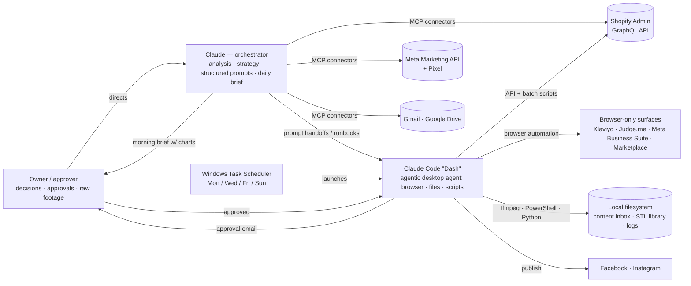

# Technical Validation Pack — AI Operations Stack

> **For the reader:** this is a small, real sample of hands-on AI-agent and integration work — an architecture diagram, the stack, the actual API operations and code used against live systems, and the runbooks that show how the agents were directed. It's meant to be skimmed in five minutes; the code is there if you want to go deeper.

**John Marquez** · Blackforge Workshop (co-founder/co-operator) · HealthBlendRX/TuSaludRX (co-founder)

This pack exists to let a technical reviewer validate hands-on AI and integration work. Everything here is real and labeled by provenance:
- **In this repo** — code and configurations executed against live systems during the work.
- **On the operator's machine** — agent artifacts that run locally (described, not reproduced here).
- **HealthBlendRX** — documented work; code available on request.

---

## 1. Architecture — the multi-agent stack

**Division of labor:** Claude does analysis, decisions, and prompt/runbook design against live data; Dash executes bulk and browser work. Handoffs are structured prompts with explicit constraints (accuracy rules, what not to touch, report-back format).

**Governance (the part that matters):** persistent operating rules and memory for the agents; human approval gates on every spend and publish action; user-created scheduled tasks with narrowly scoped permissions instead of agent self-granting; the agent explicitly refused to write its own permissions even when told it could.

---

## 2. Stack & integrations

| Layer | Components | How it connects |
|---|---|---|
| Orchestration | Claude (claude.ai) · Claude Code v2.1.x ("Dash") | MCP connectors; Chrome extension; Shopify plugin; Meta MCP |
| Commerce | Shopify Admin GraphQL API · Shopify Flow · Judge.me · Klaviyo | API (products, variants, delivery profiles, customers, files); browser for Klaviyo/Judge.me |
| Advertising | Meta Marketing API · Meta Pixel · Business Suite | campaigns / ad sets / ads / creatives / custom audiences / insights via API; Suite via browser |
| Content pipeline | Windows Task Scheduler · PowerShell launcher · ffmpeg · Python | folder ingestion → scheduled agent → edit/caption → Drive + email approval → publish |
| Data / reporting | Shopify analytics (ShopifyQL) · Meta insights · abandoned checkouts | pulled each morning into a charted brief; test data excluded by rule |
| Files / tooling | Python (reportlab, pypdf, csv) · GraphQL · JSON audience rules | see `/code` |
| HealthBlendRX | Close CRM · Zapier · Google Tag Manager · Contentsquare · WordPress/Elementor · python-pptx | CRM workflows, GTM-injected bilingual UX, Meta ads, programmatic deck generation |

---

## 3. Code in this repo (`/code`)
- `shopify_admin_graphql_examples.graphql` — the actual queries/mutations used to audit delivery profiles, find zero-weight variants (with 50/page pagination), pull abandoned checkouts with recovery URLs, reorder variant defaults without touching ads, log outreach on customer records, and bulk-fix image alt text.
- `meta_marketing_api_examples.md` — the real retargeting-audience rule JSON, the CBO ad-set config with a spend floor and Advantage+ expansion disabled, the insights fields used to diagnose junk traffic, and the learning-phase/activation mechanics that shaped decisions.
- `sort_stl_repository.py` — manifest-driven ingestion/sorting for a 126-file design library: unpacks archives, de-duplicates by SHA-1, files by designer/item, updates a CSV manifest, mirrors to backup; idempotent and re-runnable.
- `wall_sheet_generator.py` — programmatic one-page PDF (reportlab) with brand palette constants and a card grid.

## 4. Agent runbooks (`/agent_runbooks`) — how the orchestration was designed
Runbooks are the "source code" of agent orchestration: they encode the formula, the constraints, what the agent must never touch, and how it reports back.
- `blackforge_emotional_copy_spec.md` — the spec an agent used to rewrite 136+ listings: formula, per-category angle map, accuracy and credit-preservation rules, gold-standard samples.
- `blackforge_content_engine_plan.md` — pillars, cadence, folder-based ingestion, the email approval gate, and the production workflow the scheduled agent follows.
- Additional runbooks (asset-library ingestion, channel listings, email-automation audit) available on request.

## 5. Running on the operator's machine (available for live demo)
- `C:\BlackforgeContent\_engine\RUNBOOK.md` — per-run procedure; `run_if_footage.ps1` — Task Scheduler launcher that only wakes the agent when there's work; a reel cutter (ffmpeg) producing 7–15s vertical clips; `content_calendar.csv`.
- Batch Shopify mutations (weights on 967+ variants, 288 variants moved across delivery profiles) and the Meta creative/asset pipeline (Shopify CDN → Meta image library → carousel creatives).
- Two Windows scheduled tasks ("Blackforge Content Engine" midday/evening) created by the owner after the agent correctly declined to create unattended agents itself.

## 6. HealthBlendRX artifacts (available on request / live demo)
- GTM tag code: bilingual EN/ES copy injection surviving SPA re-renders (MutationObserver + `pushState` interception); trust elements; checkout modifications.
- Close CRM workflow fix (duplicate trigger — misconfigured lifecycle stage; exit condition added).
- python-pptx generator that rebuilt an 86-page business plan into a 47-slide editable deck.

---

## 7. Outcomes (operational — no revenue claims)
Catalog of 136+ listings rewritten in one pass with zero errors · 243 variants launched under an IP-safe scheme · checkout failure root-caused and fixed across 967+ variants · cost per add-to-cart cut by up to 48% · session-to-cart conversion lifted more than 4x · autonomous content pipeline shipped end to end · email automation consolidated to one owner per trigger · daily charted operations brief · local delivery and retargeting live.
