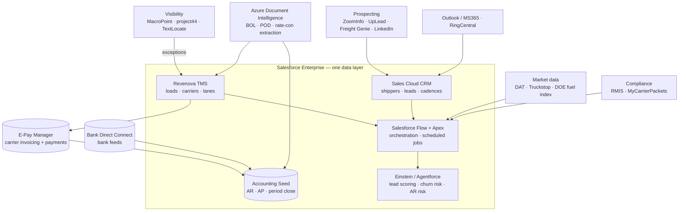

# Client Engagement — AI & Automation Strategy for a Freight Brokerage
**Option 1 Integration Partners** · prepared for a freight brokerage running Revenova TMS on Salesforce

Client name withheld. The deliverable itself is included here in full (HTML + PDF), anonymized; nothing in it is client-confidential — the business case uses industry benchmarks and the only dollar figures are public tool prices.

**The deliverable:** `AI_Automation_Strategy_Freight_Brokerage.html` — the designed original, self-contained. Download and open in any browser, or view it live at the GitHub Pages link in the main README.

## The engagement in one paragraph
A logistics brokerage running Revenova TMS — natively on Salesforce — with Accounting Seed for financials, mid-migration from one carrier-payment platform to E-Pay Manager. The strategy identifies where the stack is underused, sequences the fixes, then layers integration and AI on a single Salesforce data layer: no middleware, no sync gaps. Nine automation/AI use cases, a lead-generation tool directory, a 24/7 load-tracking exception engine, a business case, and a four-phase 38-week roadmap ending in a "prospect to paid invoice" pipeline that runs without added headcount.

## Recommended architecture

## The nine automation & AI use cases
1. **AI load-to-carrier matching** — lane history + carrier performance + capacity + live rates → ranked options (3–5× loads per dispatcher).
2. **Automated rate quoting & margin optimization** — live market data + lane history → quote with recommended margin, inside Salesforce.
3. **Document intelligence** — BOL / POD / rate-con extraction from emailed PDFs, matched to load records, billing triggered.
4. **Accounting close acceleration** — scheduled Flows for AR, invoicing, reconciliation; close becomes exception review.
5. **Carrier compliance & risk scoring** — RMIS + safety + OTP + claims → dynamic risk index; high-risk carriers flagged before assignment.
6. **Fuel-surcharge automation** — weekly DOE index → recalculated surcharges → updated confirmations, zero manual steps.
7. **AI email & communication** — context-aware drafting from load records, auto-logged calls, inbound status updates.
8. **Payment-platform integration + AR intelligence** — pre-built connector activation, invoice/payment sync, predictive aging alerts.
9. **Bank reconciliation** — Bank Direct Connect feeds matched to ledger automatically; rules auto-categorize.

Plus a sales layer (L1–L6): AI prospecting and enrichment, lead scoring, automated multi-channel cadences, shot-clock lead recycling, RFP/quote automation, churn-risk retention alerts — and a 24/7 exception engine (detect → classify → alert → notify → capture performance).

## Roadmap
**Phase 1 (wks 1–6) Stabilize & Assess** → **Phase 2 (7–14) Fix & Activate** → **Phase 3 (15–28) Integrate & Automate** → **Phase 4 (29–38+) Scale with AI**, then managed services. Governance built in: Connected App approval, Einstein data thresholds, rule-based scoring until the model has enough history.

## What this demonstrates
Enterprise AI/automation strategy on a real stack; integration architecture across TMS, CRM, accounting, payments, visibility, and document AI; sequencing that puts stability before automation and automation before AI; and a business case tied to operational levers — margin, close time, loads per head.
