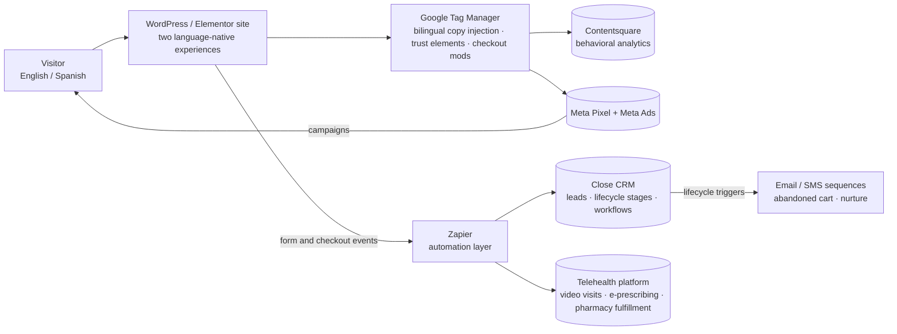

# HealthBlendRX / TuSaludRX — Integrations & Automation (Co-Founder)

Bilingual direct-to-consumer telehealth platform serving English- and Spanish-speaking patients. This section documents the integration architecture and automation work — **at the architecture level only.** No patient or lead data, no credentials, no vendor contracts. Code samples are sanitized.

## Integration map

## What was built

**1. CRM & automation stack — Close CRM · Zapier · Google Tag Manager**
Built the lead-capture-to-CRM pipeline and the workflow layer on top of it. Diagnosed and fixed a Close CRM duplicate-trigger workflow (a lifecycle stage misconfigured on the trigger, causing repeat sends) and added workflow-goal exit conditions so contacts leave a sequence once the goal is met.
→ `code/zapier_workflows.md` — each automation as trigger → action, sanitized.
→ `code/close_crm_workflow_fix.md` — the before/after logic of the duplicate-trigger fix.

**2. Bilingual UX without rebuilding the site — GTM engineering**
A Google Tag Manager layer that injects English/Spanish copy and survives single-page-app re-renders by observing DOM mutations and intercepting `pushState`, plus trust elements and checkout modifications, and Contentsquare instrumentation.
→ `code/gtm_bilingual_injection.js` — the injection tag, sanitized (no container or tag IDs).

**3. Paid acquisition — Meta Ads**
Built from the ground up; restructured after platform health-interest targeting changes; top-performing creatives identified; abandoned-cart email and SMS sequences rewritten.

**4. AI-assisted deliverables — python-pptx**
Rebuilt an 86-page business plan into a 47-slide editable PowerPoint programmatically.
→ `code/pptx_deck_builder.py` — the generator, with business-plan content removed.

## Provenance
Architecture and descriptions above are documented work. Code files marked with → are added by the owner from the HealthBlendRX systems, sanitized per `SANITIZATION_CHECKLIST.md`. Anything not yet present is available on request or by live demo.
